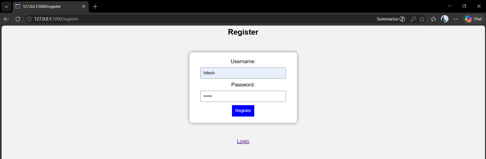
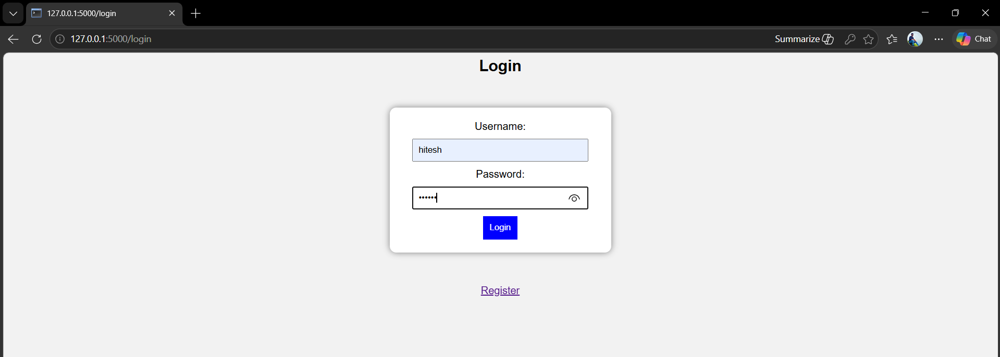
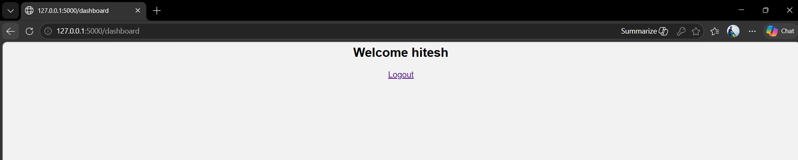
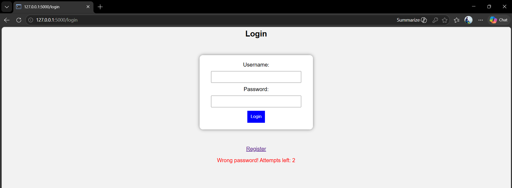
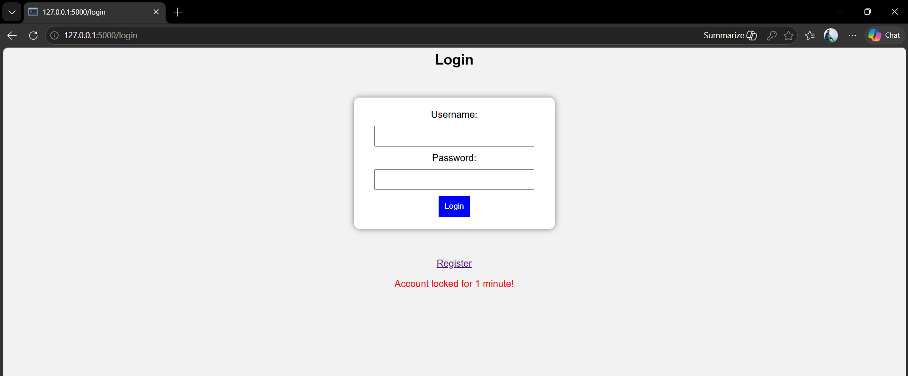

# 🔐 Secure Login System

A cybersecurity-based secure login system built using Flask and SQLite.

## 🚀 Features
- User Registration & Login
- Password Hashing using bcrypt
- Brute-force Protection
- Temporary Account Lock
- Input Validation
- Session Management

## 🛠 Technologies Used
- Python
- Flask
- SQLite
- HTML/CSS

## 🔒 Cybersecurity Concepts
- Authentication
- Password Security
- Brute-force Prevention
- Session Handling

## ▶️ Run Project

```bash
python app.py
```

Open:
http://127.0.0.1:5000

## 📷 Screenshots






## 👨‍💻 Author
Saurabh Shukla